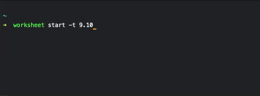

# __Work sheet[s]__

## _What & Why_
At the company where I'm currently employed there's the necessity to fill a
_Google Sheet_ with the number of hours worked in the particular day.
\
This imply the following steps:
- Open the _Google Sheet_ link from the saved bookmark on the browser
- Wait for it to load extremely slowly ... at least on my pc
- Fill in the required informations: __date__, __surname__, __job performed__
    and __hours worked__

__The purpose of this small project is to speed up this process by filling all
the required informations from the command line.__

## _Usage_
To install the package globally, clone the repo and run this command inside the project folder:
\
`$ npm i -g .`

The script uses the [Google Sheet API](https://developers.google.com/sheets/api/quickstart/nodejs)
to save partial time information in _Sheet 1_ (e.g. 9.00-13.00):

Set start time to 9.30
\
`$ worksheet start -t 9.30`

Set stop time to current time
\
`$ worksheet stop`

Once there's at least a time interval in _Sheet 1_ it's possible to save the total
amount of time worked into _Sheet 2_ (the official sheet that needs to be compiled)
with the command:
\
`worksheet end-day`

This command compute the total amount of time worked approximating to the quarter,
by defect or excess if the quarter is passed by more o less than __7 minutes and 30 seconds__.
\
For example __7h 50m__ becomes __7h 45m__, while __7h 55m__ becomes __8h__

 

  

## _Telegram Bot_
The project contains also a telegram bot from which it's possible to execute
the same command of the CLI. It also checks periodically if the total time is
close to 8 hours to send a notification with a random inspirational quote.
\
It has been fun to program the bot but I've never actually used it 🤓